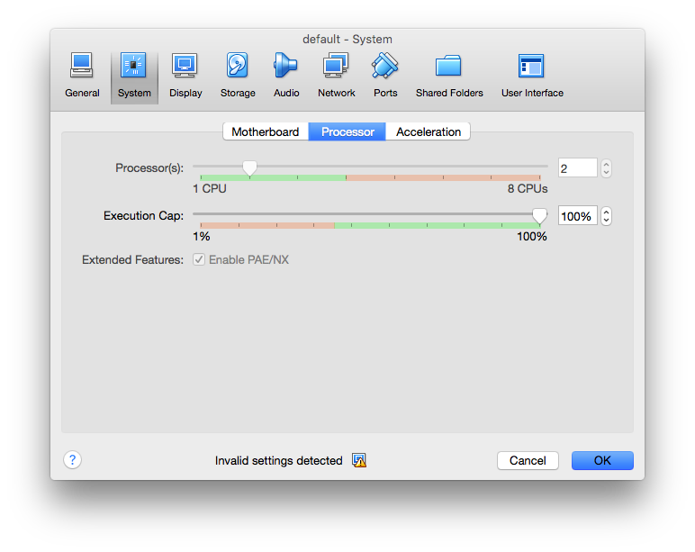
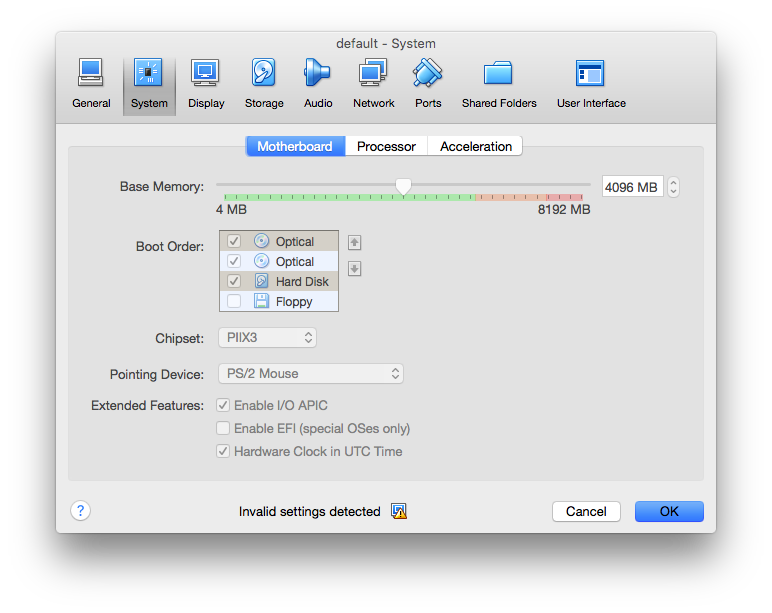

# Compiling Heron with Docker

To use Heron, you will need to compile it for the environment that you
want to use it in. If you'd like to use Docker to create that build environment,
Heron provides a convenient script to make that process easier.

Currently, only Ubuntu 14.04 and CentOS 7 are supported, but if you need another
platform there are instructions for adding new ones
[below](#contributing-new-environments).

## Requirements

* [Docker](https://docs.docker.com)

## Recommendation

If you are running docker in a virtual machine, it is recommended that
you adjust your settings to help speed up the build. To do this, open
VirtualBox and go to the container which docker is running in (usually
default or whatever name you used to create the VM). Click on the
virtual machine and then click on settings.

**Note**: You will need to stop the virtual machine before modifying
these settings.




## Building Heron

Heron provides a `build-arfifacts.sh` script for Docker located in the
`docker` folder. To run that script:

```bash
$ cd /path/to/heron/repo
$ docker/build-artifacts.sh
```

Running the script by itself will display usage information:

```
Usage: docker/build-artifacts.sh <platform> <version-string> [source-tarball] <output-directory>

Platforms: ubuntu14.04, centos7

Example:
  docker/build-artifacts.sh ubuntu14.04 0.1.0-SNAPSHOT ~/heron-release

NOTE: If running on OSX, the output directory will need to
      be under /Users so virtualbox has access to.
```

The following arguments are required:

* `platform` --- Currently, this can be one of: `ubuntu14.04`, `centos7`.
* `version-string` --- The Heron release for which you'd like to build
  artifacts.
* `output-directory` --- The directory in which you'd like the release to be
  built.

Here's an example usage:

```bash
$ docker/build-artifacts.sh ubuntu14.04 0.1.0-SNAPSHOT ~/heron-release
```

This will build a docker container specific to Ubuntu 14.04, create a source
tarball of the heron repository, run a full release build of heron, then copy
the artifacts into the ~/heron-release directory.

Optionally, you can also include a tarball of the Heron source if you have one.
By default, the script will create a tarball of the current source in the Heron
repo and use that to build the artifacts.

**Note**: If you are running on Mac OS X, Docker must be run inside a virtual
machine. Therefore, you must make sure that both the source tarball and
destination directory are somewhere under your home directory. For example, you
cannot output the Heron artifacts to `/tmp` because `/tmp` refers to the
directory inside the VM, not on the host machine. Your home directory, however,
is automatically linked in to the VM and can be accessed normally.

After the build has completed, you can go to your output directory and see all
of the generated artifacts:

```bash
$ ls ~/heron-release
heron-0.1.0-SNAPSHOT.tar.gz
heron-api-0.1.0-SNAPSHOT.tar.gz
heron-bin-0.1.0-SNAPSHOT.tar.gz
heron-cli-0.1.0-SNAPSHOT.tar.gz
heron-conf-0.1.0-SNAPSHOT.tar.gz
heron-core-0.1.0-SNAPSHOT.tar.gz
# etc
```

## Contributing New Environments

You'll notice that there are multiple
[Dockerfiles](https://docs.docker.com/engine/reference/builder/) in the `docker`
directory of Heron's source code, one for each of the currently supported
platforms.

To add support for a new platform, add a new `Dockerfile` to that directory and
append the name of the platform to the name of the file. If you'd like to add
support for Debian 8, for example, add a file named `Dockerfile.debian8`. Once
you've done that, follow the instructions in the [Docker
documentation](https://docs.docker.com/engine/articles/dockerfile_best-practices/).

You should make sure that your `Dockerfile` specifies all of the following:

1. The OS being used in a
   [`FROM`](https://docs.docker.com/engine/reference/builder/#from) statement.
   Here's an example:

   ```dockerfile
   FROM centos:centos7
   ```
2. A `TARGET_PLATFORM` environment variable using the
   [`ENV`](https://docs.docker.com/engine/reference/builder/#env) instruction.
   Here's an example:

   ```dockerfile
   ENV TARGET_PLATFORM centos
   ```
3. A general dependency installation script using a
   [`RUN`](https://docs.docker.com/engine/reference/builder/#run) instruction.
   Here's an example:

   ```dockerfile
   RUN apt-get update && apt-get -y install \
         automake \
         build-essential \
         cmake \
         curl \
         libssl-dev \
         git \
         libtool \
         libunwind8 \
         libunwind-setjmp0-dev \
         python \
         python2.7-dev \
         python-software-properties \
         software-properties-common \
         python-setuptools \
         unzip \
         wget
   ```

4. An installation script for Java 8 and a `JAVA_HOME` environment variable.
   Here's an example:

   ```dockerfile
   RUN \
     echo oracle-java8-installer shared/accepted-oracle-license-v1-1 select true | debconf-set-selections && \
     add-apt-repository -y ppa:webupd8team/java && \
     apt-get update && \
     apt-get install -y oracle-java8-installer && \
     rm -rf /var/lib/apt/lists/* && \
     rm -rf /var/cache/oracle-jdk8-installer
   ENV JAVA_HOME /usr/lib/jvm/java-8-oracle
   ```

5. 

6. Add the `bazelrc` configuration file for Bazel and the `compile.sh` script:

   ```dockerfile
   ADD bazelrc /root/.bazelrc
   ADD compile.sh /compile.sh
   ```
