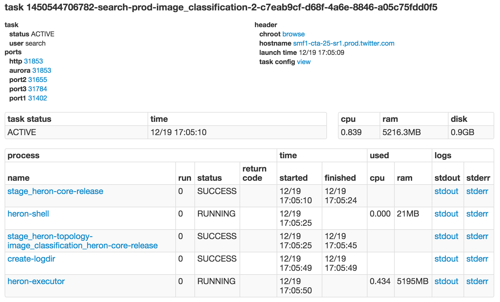

# Heron Shell

**Heron Shell** is not a shell in the traditional sense but rather a user
interface that can be used to debug Heron topologies at the
[container](../concepts/architecture.html#container). Heron Shell consists of
two basic components:

1. A web UI that relies on a REST API that exposes information about the Heron
container.
2. An HTTP server that exposes that REST API. This server runs as a separate
process in each container.

The port to connect to heron shell for each container is stored in physical
plan. Heron tracker picks up this port and connects to shell for appropriate use
cases. See the next section for more details.

## Heron Shell UI

## Heron Shell REST API

* [`/jmap`](#jmap-of-a-process)
* [`/histo`](#memory-histogram-of-a-process)
* [`/jstack`](#jstack-of-a-process)
* [`/pid`](#pid-of-a-process)
* [`/file`]()
* [`/filedata`]()
* [`/download`]()

### Log files

This is probably the most useful utility of shell. Since relative paths to log
files is known, these paths are directly embedded in UI through Tracker. This
makes the logs available at a click right in the browser. The log files start at
the end and users can scroll them up a page at a time, or download them locally.

### Browse

A container is expected to run in a sandbox from a directory. All the files
under this directory are accessible through shell. This can be used to download
the jars or tars for a topology, or browse through, download, or even view the
files online. Viewing and downloading log files is one special case of this.

### Pid of a process

Each instance in the topology runs as a separate jvm process. This allows us to
monitor each spout or bolt instance in isolation. To run more sophisticated
operations on the process as mentioned in this list below, we need to know the
process id of the process running as that instance.

### Jstack of a process

This utility runs the `jstack` command on the jvm process that is running one
instance. The result is passed back through the REST API which can be viewed
directly in the browser.

### Jmap of a process

This utility runs `jmap` on the process running one instance. Since a map can be
huge, a dump file is created on the host that is running the container. This
file can be downloaded using the info that is returned as the response to this
endpoint. The dumps are also accessible through the "browse" utility.

### Memory histogram of a process

This utility runs `jmap` with the `-histo` option, to output the memory
histogram for the JVM process of one instance. The resulting histogram is passed
back as part of the response, and can be viewed directly in the browser.

