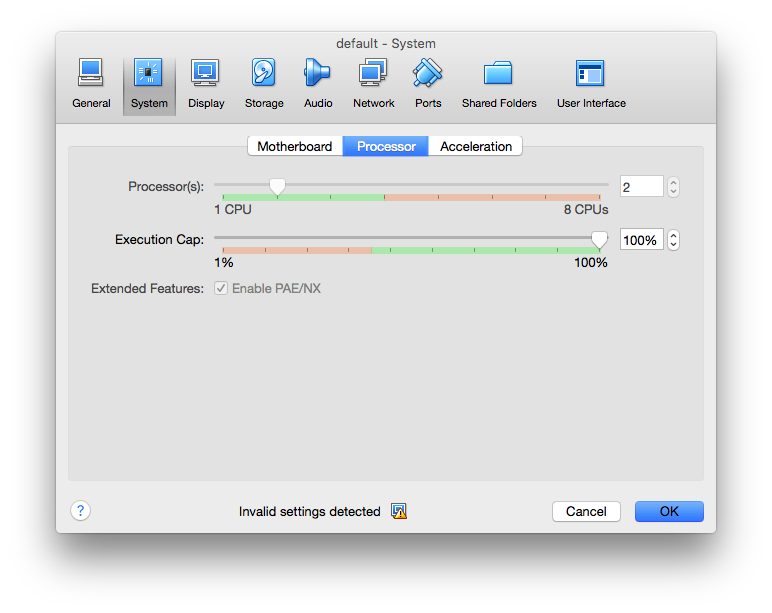
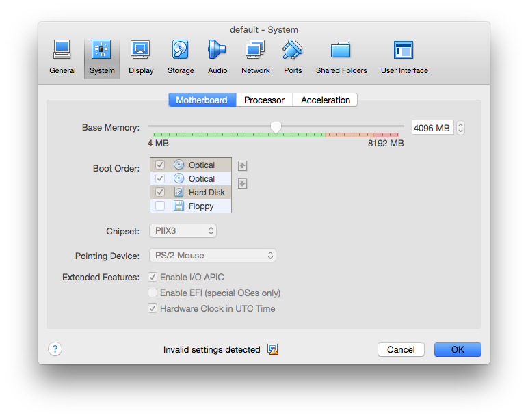

<!--
    Licensed to the Apache Software Foundation (ASF) under one
    or more contributor license agreements.  See the NOTICE file
    distributed with this work for additional information
    regarding copyright ownership.  The ASF licenses this file
    to you under the Apache License, Version 2.0 (the
    "License"); you may not use this file except in compliance
    with the License.  You may obtain a copy of the License at
      http://www.apache.org/licenses/LICENSE-2.0
    Unless required by applicable law or agreed to in writing,
    software distributed under the License is distributed on an
    "AS IS" BASIS, WITHOUT WARRANTIES OR CONDITIONS OF ANY
    KIND, either express or implied.  See the License for the
    specific language governing permissions and limitations
    under the License.
-->

For developing Heron, you will need to compile it for the environment that you
want to use it in. If you'd like to use Docker to create that build environment,
Heron provides a convenient script to make that process easier.

Currently Debian10 and Ubuntu 20.04 are actively being supported.  There is also limited support for Ubuntu 18.04, and CentOS 8. If you
need another platform there are instructions for adding new ones
[below](#contributing-new-environments).

### Requirements

* [Docker](https://docs.docker.com)

### Running Docker in a Virtual Machine

If you are running Docker in a virtual machine (VM), it is recommended that you
adjust your settings to help speed up the build. To do this, open
[VirtualBox](https://www.virtualbox.org/wiki/Downloads) and go to the container
in which Docker is running (usually "default" or whatever name you used to
create the VM), click on the VM, and then click on **Settings**.

**Note**: You will need to stop the VM before modifying these settings.




## Building Heron

Heron provides a `build-arfifacts.sh` script for Docker located in the
`docker` folder. To run that script:

```bash
$ cd /path/to/heron/repo
$ docker/build-artifacts.sh
```

Running the script by itself will display usage information:

```
Script to build heron docker image for different platforms
  Input - directory containing the artifacts from the directory <artifact-directory>
  Output - docker image tar file saved in the directory <artifact-directory> 
  
Usage: ./docker/scripts/build-docker.sh <platform> <version_string> <artifact-directory> [-s|--squash]
  
Argument options:
  <platform>: darwin, debian10, ubuntu20.04, centos8
  <version_string>: Version of Heron build, e.g. v0.17.5.1-rc
  <artifact-directory>: Location of compiled Heron artifact
  [-s|--squash]: Enables using Docker experimental feature --squash
  
Example:
  ./build-docker.sh ubuntu20.04 0.12.0 ~/ubuntu

NOTE: If running on OSX, the output directory will need to
      be under /Users so virtualbox has access to.
```

The following arguments are required:

* `platform` --- Currently we are focused on supporting the `debian10` and `ubuntu20.04` platforms.  
We also support building Heron locally on OSX.  You can specify this as listing `darwin` as the platform.
 All options are:
   - `centos8`
   - `darwin`
   - `debian10`
   - `ubuntu18.04`
   - `ubuntu20.04`
    
   
  You can add other platforms using the [instructions
  below](#contributing-new-environments).
* `version-string` --- The Heron release for which you'd like to build
  artifacts.
* `output-directory` --- The directory in which you'd like the release to be
  built.

Here's an example usage:

```bash
$ docker/scripts/build-artifacts.sh debian10 0.22.1-incubating ~/heron-release
```

This will build a Docker container specific to Debian10, create a source
tarball of the Heron repository, run a full release build of Heron, and then
copy the artifacts into the `~/heron-release` directory.

Optionally, you can also include a tarball of the Heron source if you have one.
By default, the script will create a tarball of the current source in the Heron
repo and use that to build the artifacts.

**Note**: If you are running on Mac OS X, Docker must be run inside a VM.
Therefore, you must make sure that both the source tarball and destination
directory are somewhere under your home directory. For example, you cannot
output the Heron artifacts to `/tmp` because `/tmp` refers to the directory
inside the VM, not on the host machine. Your home directory, however, is
automatically linked in to the VM and can be accessed normally.

After the build has completed, you can go to your output directory and see all
of the generated artifacts:

```bash
$ ls ~/heron-release
heron-0.22.1-incubating-debian10.tar
heron-0.22.1-incubating-debian10.tar.gz
heron-core-0.22.1-incubating-debian10.tar.gz
heron-install-0.22.1-incubating-debian10.sh
heron-layer-0.22.1-incubating-debian10.tar
heron-tools-0.22.1-incubating-debian10.tar.gz
```

## Set Up A Docker Based Development Environment

In case you want to have a development environment instead of making a full build,
Heron provides two helper scripts for you. It could be convenient if you don't want
to set up all the libraries and tools on your machine directly.

The following commands are to create a new docker image with a development environment
and start the container based on it:
```bash
$ cd /path/to/heron/repo
$ docker/scripts/dev-env-create.sh heron-dev
```

After the commands, a new docker container is started with all the libraries and tools
installed. The operation system is Ubuntu 18.04 by default. Now you can build Heron
like:
```bash
\# bazel build --config=linux scripts/packages:binpkgs
\# bazel build --config=linux scripts/packages:tarpkgs
```

The current folder is mapped to the '/heron' directory in the container and any changes
you make on the host machine will be reflected in the container. Note that when you exit
the container and re-run the script, a new container will be started with a fresh new
environment.

When a development environment container is running, you can use the follow script
to start a new terminal in the container.
```bash
$ cd /path/to/heron/repo
$ docker/scripts/dev-env-run.sh heron-dev
```

## Contributing New Environments

You'll notice that there are multiple
[Dockerfiles](https://docs.docker.com/engine/reference/builder/) in the `docker`
directory of Heron's source code, one for each of the currently supported
platforms.

To add support for a new platform, add a new `Dockerfile` to that directory and
append the name of the platform to the name of the file. If you'd like to add
support for Debian 8, for example, add a file named `Dockerfile.debian8`. Once
you've done that, follow the instructions in the [Docker
documentation](https://docs.docker.com/engine/articles/dockerfile_best-practices/).

You should make sure that your `Dockerfile` specifies *at least* all of the
following:

### Step 1 --- The OS being used in a [`FROM`](https://docs.docker.com/engine/reference/builder/#from) statement.

Here's an example:

```dockerfile
FROM centos:centos8
 ```

### Step 2 --- A `TARGET_PLATFORM` environment variable using the [`ENV`](https://docs.docker.com/engine/reference/builder/#env) instruction.

Here's an example:

```dockerfile
ENV TARGET_PLATFORM centos
```

### Step 3 --- A general dependency installation script using a [`RUN`](https://docs.docker.com/engine/reference/builder/#run) instruction.

Here's an example:

```dockerfile
RUN apt-get update && apt-get -y install \
         automake \
         build-essential \
         cmake \
         curl \
         libssl-dev \
         git \
         libtool \
         libunwind8 \
         libunwind-setjmp0-dev \
         python \
         python2.7-dev \
         python-software-properties \
         software-properties-common \
         python-setuptools \
         unzip \
         wget
```

### Step 4 --- An installation script for Java 11 and a `JAVA_HOME` environment variable

Here's an example:

```dockerfile
RUN \
     echo oracle-java8-installer shared/accepted-oracle-license-v1-1 select true | debconf-set-selections && \
     add-apt-repository -y ppa:webupd8team/java && \
     apt-get update && \
     apt-get install -y openjdk-11-jdk-headless && \
     rm -rf /var/lib/apt/lists/*

ENV JAVA_HOME /usr/lib/jvm/java-11-openjdk-amd64
```

#### Step 5 - An installation script for [Bazel](http://bazel.io/) version {} or above.
Here's an example:

```dockerfile
RUN wget -O /tmp/bazel.sh https://github.com/bazelbuild/bazel/releases/download/0.26.0/bazel-0.26.0-installer-linux-x86_64.sh \
         && chmod +x /tmp/bazel.sh \
         && /tmp/bazel.sh
```

### Step 6 --- Add the `bazelrc` configuration file for Bazel and the `compile.sh` script (from the `docker` folder) that compiles Heron

```dockerfile
ADD bazelrc /root/.bazelrc
ADD compile.sh /compile.sh
```
