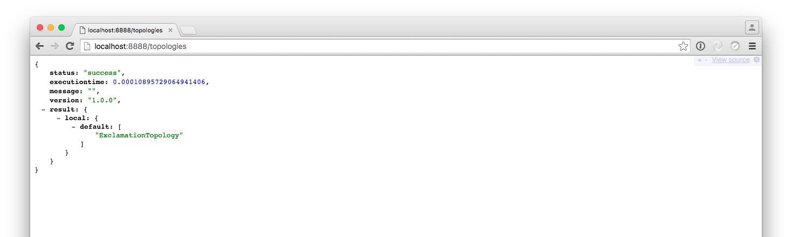
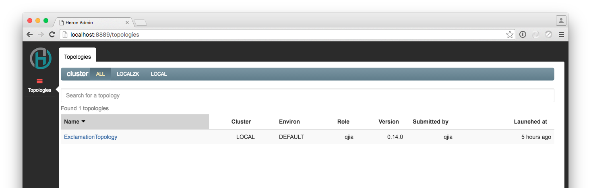

<!--
    Licensed to the Apache Software Foundation (ASF) under one
    or more contributor license agreements.  See the NOTICE file
    distributed with this work for additional information
    regarding copyright ownership.  The ASF licenses this file
    to you under the Apache License, Version 2.0 (the
    "License"); you may not use this file except in compliance
    with the License.  You may obtain a copy of the License at
      http://www.apache.org/licenses/LICENSE-2.0
    Unless required by applicable law or agreed to in writing,
    software distributed under the License is distributed on an
    "AS IS" BASIS, WITHOUT WARRANTIES OR CONDITIONS OF ANY
    KIND, either express or implied.  See the License for the
    specific language governing permissions and limitations
    under the License.
-->

> The current version of Heron is {{heron:version}}


The easiest way to get started learning Heron is to install the Heron client tools, which are currently available for:

* [MacOS](#macos-homebrew)
* [Ubuntu >= 14.04](#using-installation-scripts)
* [CentOS](#using-installation-scripts)

For other platforms, you need to build from source. Please refer to the [guide to compiling Heron](compiling-overview).

## Step 1 --- Download the Heron tools

Heron tools can be installed on [macOS](#macos-homebrew) using [Homebrew](https://brew.sh) and on Linux using [installation scripts](#using-installation-scripts).

> You can install using [installation scripts](#using-installation-scripts) on macOS as well.

## macOS/Homebrew

The easiest way to get started with Heron on macOS is using [Homebrew](https://brew.sh):

```bash
$ brew tap streamlio/homebrew-formulae
$ brew update
$ brew install heron
```

This will install a variety of executables and other resources by default in `/usr/local/opt/heron`.

> Homebrew may use a different folder than `/usr/local/opt/heron`. To check which folder is being used, run `brew --prefix heron`.

## Using installation scripts

To install Heron binaries directly, using installation scripts, go to Heron's [releases page](https://github.com/apache/incubator-heron/releases) on GitHub
and see a full listing of Heron releases for each available platform. The installation script for macOS (`darwin`), for example, is named
`heron-install-{}-darwin.sh`.

```bash
$ wget https://github.com/apache/incubator-heron/releases/download/{}/heron-install-{}-darwin.sh
```

Download the for your platform either from the releases page or using [`wget`](https://www.gnu.org/software/wget/). Here's a `wget` example for Ubuntu:

```bash
$ wget https://github.com/apache/incubator-heron/releases/download/{}/heron-install-{}-ubuntu.sh
```

Once you've downloaded the script, make it executable using [chmod](https://en.wikipedia.org/wiki/Chmod):

```bash
$ chmod +x heron-*.sh
```

> The script will install executables in the `~/bin` folder. You should add that folder to your `PATH` using `export PATH=~/bin:$PATH`.

Now run the [Heron client](user-manuals-heron-cli) installation script with the `--user` flag set. Here's an example for Ubuntu:

```bash
$ ./heron-install-{}-ubuntu.sh --user
Heron installer
---------------

Uncompressing...done
...
Heron is now installed!
```

To check that Heron is successfully installed, run `heron version`:

```bash
$ heron version
heron.build.git.revision : 26bb4096130a05f9799510bbce6c37a69a7342ef
heron.build.git.status : Clean
heron.build.host : ...
heron.build.time : Sat Aug  6 12:35:47 PDT {}
heron.build.timestamp : 1470512147000
heron.build.user : ...
heron.build.version : {}
```

## Step 2 --- Launch an example topology

> #### Note for macOS users

> If you want to run topologies locally on macOS, you may need to add your
> hostname to your `/etc/hosts` file under `localhost`. Here's an example line:
> `127.0.0.1 localhost My-Mac-Laptop.local`. You can fetch your hostname by simply
> running `hostname` in your shell.

If you set the `--user` flag when running the installation scripts, some example
topologies will be installed in your `~/.heron/examples` directory. You can
launch an example [topology](heron-topology-concepts) locally (on your machine)
using the [Heron CLI tool](user-manuals-heron-cli):

```bash
$ heron submit local \
  ~/.heron/examples/heron-streamlet-examples.jar \
  org.apache.heron.examples.streamlet.WindowedWordCountTopology \
  WindowedWordCountTopology \
  --deploy-deactivated
```

The output should look something like this:

```bash
INFO: Launching topology 'WindowedWordCountTopology'

...

INFO: Topology 'WindowedWordCountTopology' launched successfully
INFO: Elapsed time: 3.409s.
```

This will *submit* the topology to your locally running Heron cluster but it
won't *activate* the topology because the `--deploy-deactivated` flag was set.
Activating the topology will be explored in [step
5](#step-5-explore-topology-management-commands) below.

Note that the output shows whether the topology has been launched successfully as well
the working directory for the topology.

To check what's under the working directory, run:

```bash
$ ls -al ~/.herondata/topologies/local/${ROLE}/WindowedWordCountTopology
-rw-r--r--   1 username  staff     6141 Oct 12 09:58 WindowedWordCountTopology.defn
-rw-r--r--   1 username  staff        5 Oct 12 09:58 container_1_flatmap1_4.pid
-rw-r--r--   1 username  staff        5 Oct 12 09:58 container_1_logger1_3.pid
# etc.
```

All instances' log files can be found in `log-files` under the working directory:

```bash
$ ls -al ~/.herondata/topologies/local/${ROLE}/WindowedWordCountTopology/log-files
total 408
-rw-r--r--   1 username  staff   5055 Oct 12 09:58 container_1_flatmap1_4.log.0
-rw-r--r--   1 username  staff      0 Oct 12 09:58 container_1_flatmap1_4.log.0.lck
-rw-r--r--   1 username  staff   5052 Oct 12 09:58 container_1_logger1_3.log.0
# etc.
```

## Step 3 --- Start Heron Tracker

The [Heron Tracker](user-manuals-heron-tracker-runbook) is a web service that
continuously gathers information about your Heron cluster. You can launch the
tracker by running the `heron-tracker` command (which is already installed):

```bash
$ heron-tracker
... Running on port: 8888
... Using config file: $HOME/.herontools/conf/heron_tracker.yaml
```

You can reach Heron Tracker in your browser at [http://localhost:8888](http://localhost:8888)
and see something like the following upon successful submission of the topology:


To explore Heron Tracker, please refer to [Heron Tracker Rest API](user-manuals-tracker-rest)

## Step 4 --- Start Heron UI

[Heron UI](user-manuals-heron-ui-runbook) is a user interface that uses Heron Tracker to
provide detailed visual representations of your Heron topologies. To launch
Heron UI:

```bash
$ heron-ui
... Running on port: 8889
... Using tracker url: http://localhost:8888
```

You can open Heron UI in your browser at [http://localhost:8889](http://localhost:8889)
and see something like this upon successful submission of the topology:


To play with Heron UI, please refer to [Heron UI Usage Guide](guides-ui-guide)

## Step 5 --- Explore topology management commands

In step 2 you submitted a topology to your local cluster. The `heron` CLI tool
also enables you to activate, deactivate, and kill topologies and more.

```bash
$ heron activate local WindowedWordCountTopology
$ heron deactivate local WindowedWordCountTopology
$ heron kill local WindowedWordCountTopology
```

Upon successful actions, a message similar to the following will appear:

```bash
INFO: Successfully activated topology 'WindowedWordCountTopology'
INFO: Elapsed time: 1.980s.
```

For more info on these commands, read about [topology
lifecycles](heron-topology-concepts#topology-lifecycle).

To list the available CLI commands, run `heron` by itself:

```bash
usage: heron <command> <options> ...

Available commands:
    activate           Activate a topology
    deactivate         Deactivate a topology
    help               Prints help for commands
    kill               Kill a topology
    restart            Restart a topology
    submit             Submit a topology
    version            Print version of heron-cli

For detailed documentation, go to http://heronstreaming.io
```

To invoke help output for a command, run `heron help COMMAND`. Here's an
example:

```bash
$ heron help submit
usage: heron submit [options] cluster/[role]/[environ] topology-file-name topology-class-name [topology-args]

Required arguments:
  cluster/[role]/[env]  Cluster, role, and environ to run topology
  topology-file-name    Topology jar/tar/zip file
  topology-class-name   Topology class name

Optional arguments:
  --config-path (a string; path to cluster config; default: "$HOME/.heron/conf")
  --config-property (key=value; a config key and its value; default: [])
  --deploy-deactivated (a boolean; default: "false")
  -D DEFINE             Define a system property to pass to java -D when
                        running main.
  --verbose (a boolean; default: "false")
```

## Step 6 --- Explore other example topologies

The source code for the example topologies can be found
[on
GitHub]({}/examples/src/java/org/apache/heron/examples).
The included example topologies:

* `AckingTopology.java` --- A topology with acking enabled.
* `ComponentJVMOptionsTopology.java` --- A topology that supplies JVM options
  for each component.
* `CustomGroupingTopology.java` --- A topology that implements custom grouping.
* `ExclamationTopology.java` --- A spout that emits random words to a bolt that
  then adds an exclamation mark.
* `MultiSpoutExclamationTopology.java` --- a topology with multiple spouts.
* `MultiStageAckingTopology.java` --- A three-stage topology. A spout emits to a
  bolt that then feeds to another bolt.
* `TaskHookTopology.java` --- A topology that uses a task hook to subscribe to
   event notifications.

## Troubleshooting
In case of any issues, please refer to [Quick Start Troubleshooting](getting-started-troubleshooting-guide).

### Next Steps

* [Migrate Storm topologies](getting-started-migrate-storm-topologies) to Heron with simple `pom.xml`
  changes
* [Deploy topologies](deployment-overview) in clustered, scheduler-driven
  environments (such as on [Aurora](schedulers-aurora-cluster)
  and [locally](schedulers-local))
* [Develop topologies](heron-architecture) for Heron
