### Overview

This guide describes how to make best use of Heron UI for monitoring and
debugging topologies.

The UI provides a lot of information about a topology or a part of it quickly,
thus reducing debugging time considerably. Some of these features are
listed below. A complete set of features can be found in following sections.

1. See logical plan of a topology
2. See physical plan of a topology
3. Configs of a topology
4. See some basic metrics for each of the instances and components
5. Links to get logs, memory histogram, jstack, heapdump and exceptions of
   a particular instance

#### Topologies Page

Below is the home page of Heron UI.

The following information or actions can be found on this page.

1. List of all topologies
2. Number of topologies filtered after search (total by default)
3. A topology's overview
4. Filter the topologies using `cluster`
5. Filter the topologies using string matching in names, clusters, environs,
   roles, versions, or submitters
6. Sort the topologies based on a particular column
7. Click on the topology name to find more info about the topology

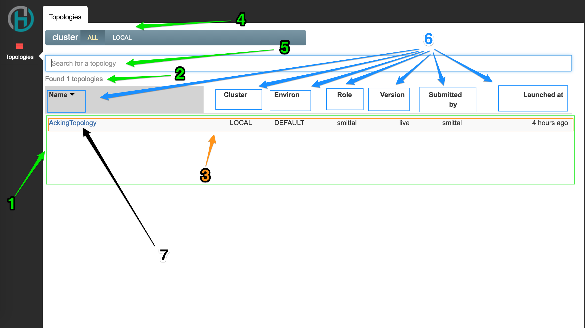

#### Topology Page

Below is the main page to monitor a topology.

1. Name of the topology
2. [Logical plan](../../concepts/topologies#logical-plan) of the topology
3. [Physical plan](../../concepts/topologies#physical-plan) of the topology
4. Health metrics for the topology
5. General info about the topology
6. General metrics for the topology
7. Click components for more details
8. Click instances for more details
9. Click on aggregated metrics to color instances by metrics
10. Link to topology level configs
11. Link to job page  only if the scheduler provides a link
   <!-- (TODO: Link to this guide) -->
12. Link to viz dashboard for this topology only if Tracker is configured with
   one. <!-- (TODO: Link to this configuration) -->

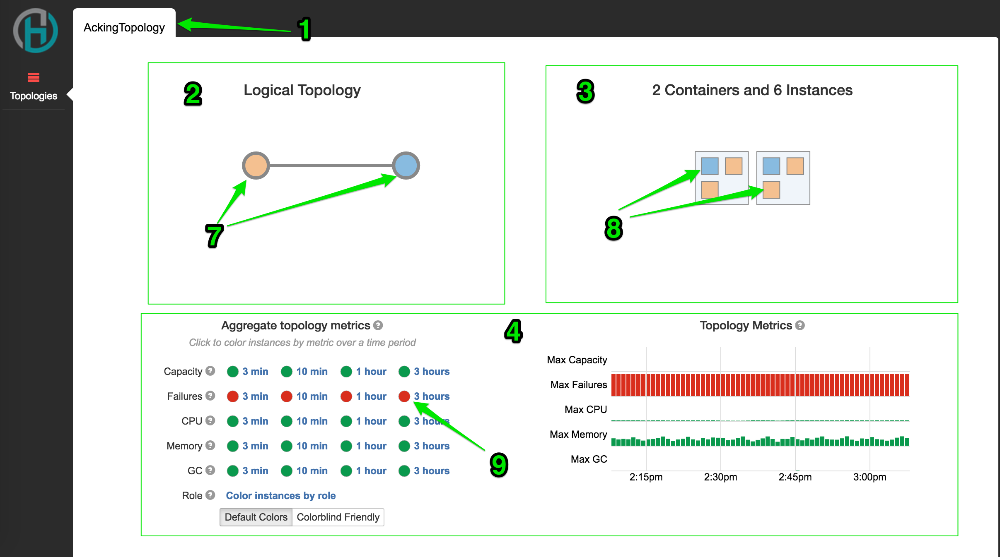

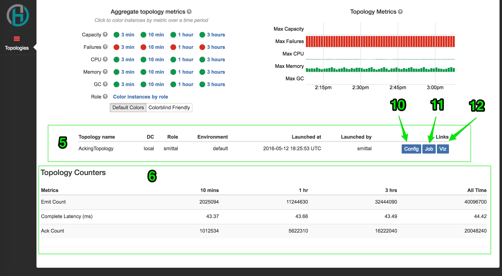

Each node in logical plan can be clicked for more specific info about that
component.

1. Averaged or max metrics for all instances of this component
2. Aggregated metrics for all instances of this component
3. List of all instances and their aggregated metrics
4. [Instance level operations](#instance-actions-pages), which are described in more details below

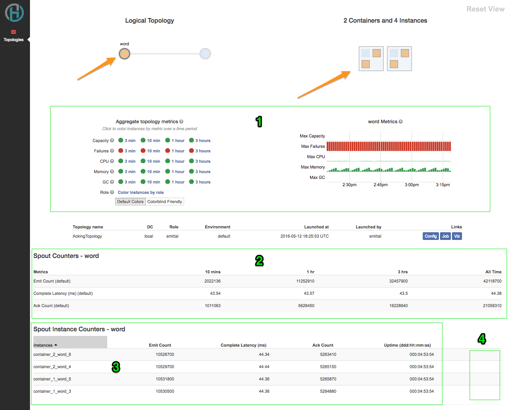

Clicking on an instance will highlight that instance in the list.

1. Aggregated metrics are only for this instance
2. Quick access to logs, exceptions and job pages for this instance
3. Component counters are still aggregated for all instances
4. The selected instance is highlighted

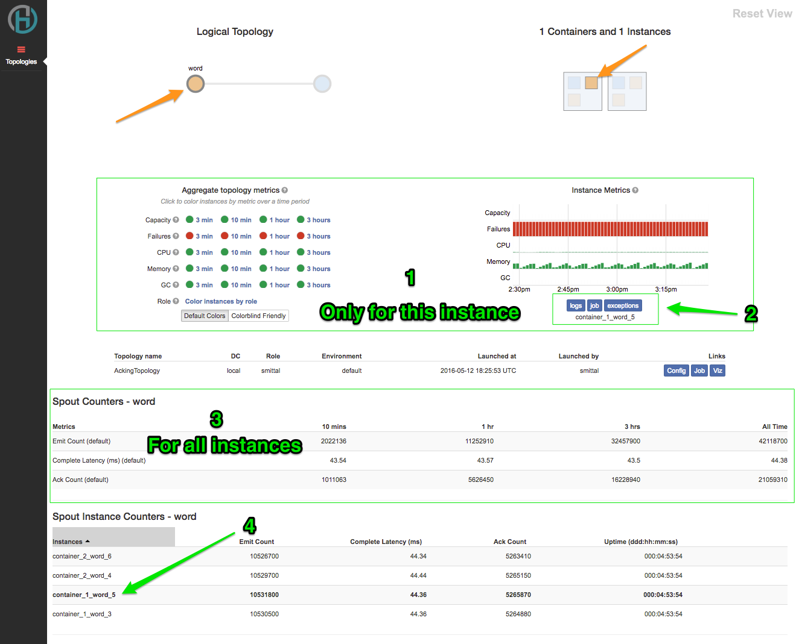

#### Aggregate Topology Metrics

Selecting a metric will highlight the components and instances based on their
health with respect to the metric, green being healthy, red indicating a problem.
This is a quick way to find out which instances are having issues.

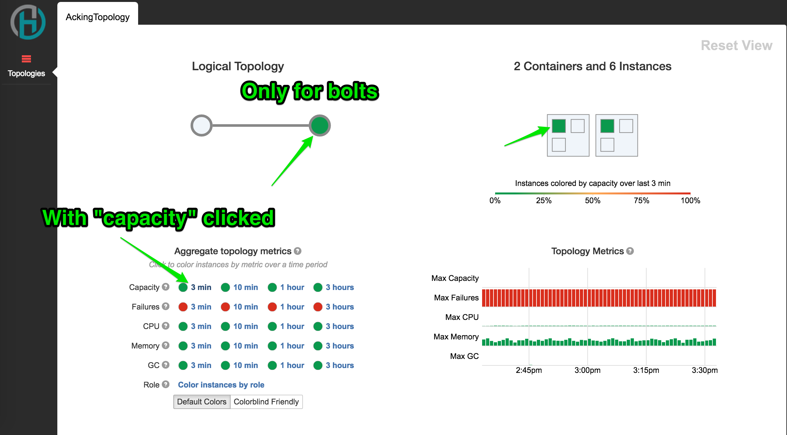

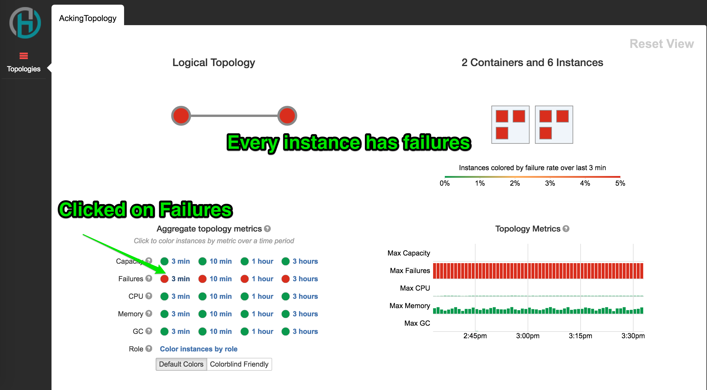

#### Config Page

These are the topology configurations <!-- (TODO: Add link to Topology
Configurations) --> that your topology is configured with. Note that spout and
bolt level configurations are not part of topology config.

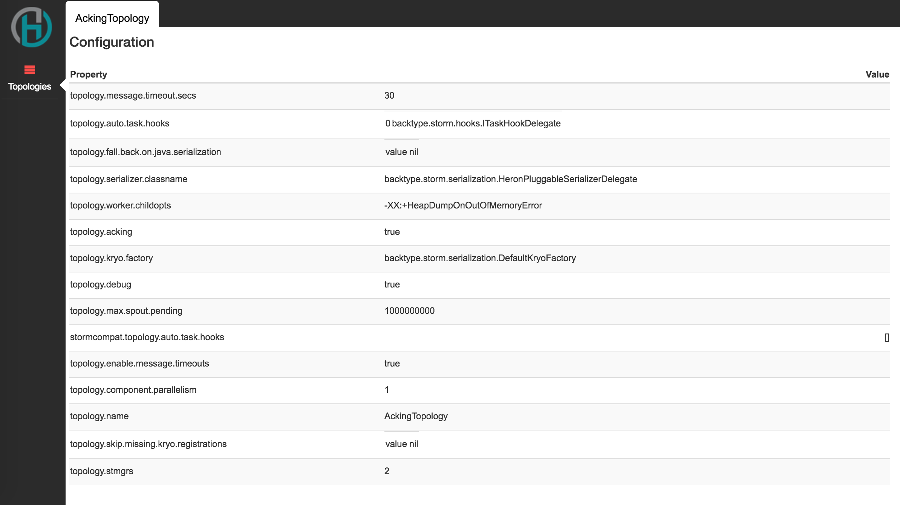

#### <a name="instance-actions-pages">Instance Action Pages</a>

These actions are available for all the instances. They are described in the
next sections.

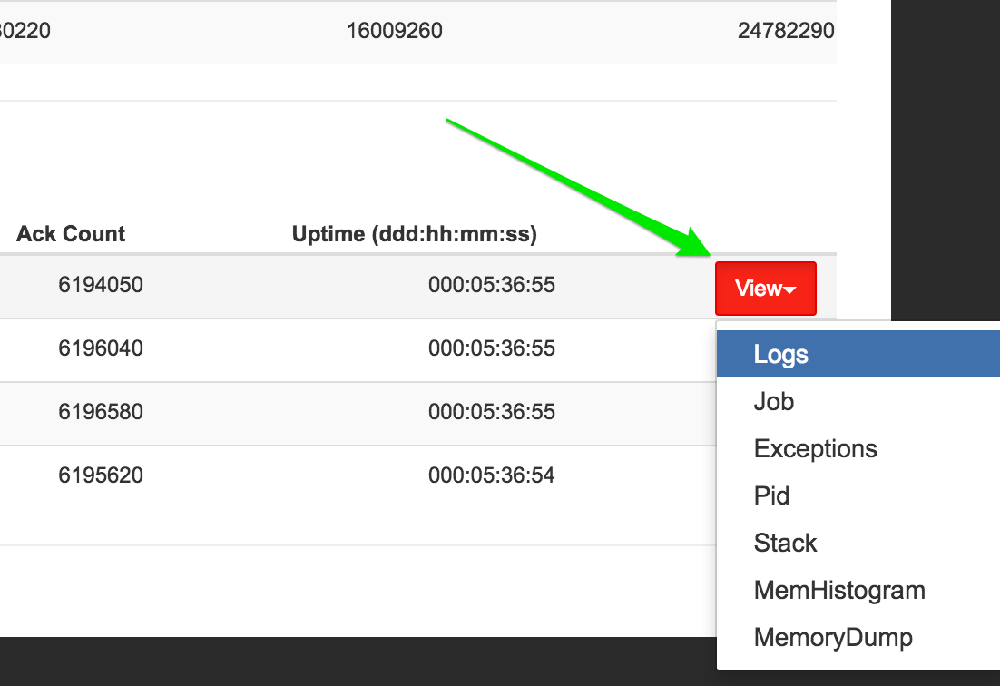

#### Logs Page

These are the logs generated by the selected instance. The whole logs file can
also be downloaded.

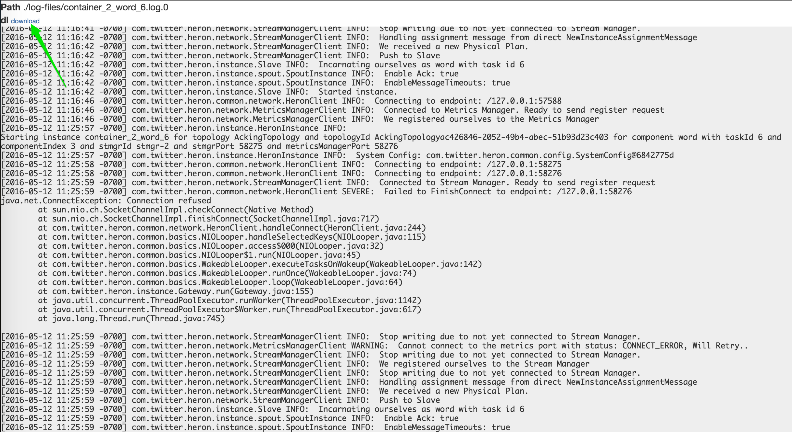

#### Job Page

Below is the directory view of the container. All instances from a container
will point to the same job page. Following information is available on this page,
amongst other things.

1. The jar or tar file associated with this topology
2. Logs for heron-executor <!-- TODO: Link heron-executor -->
3. `log-files` folder which has instance logs, as well as `stream manager` or
   `tmaster` logs.

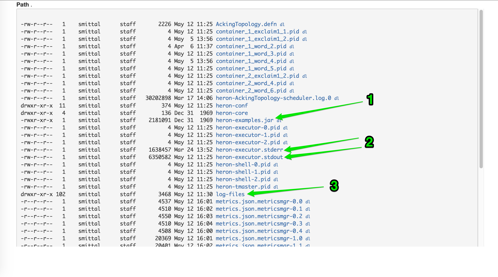

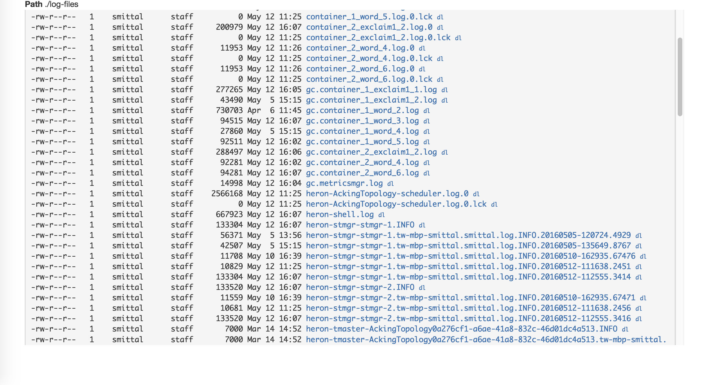

#### Exceptions Page

This page lists all exceptions logged by this instance. The exceptions are
deduplicated, and for each exception, the page shows the number of times this
exception occurred, the latest and the oldest occurance times.

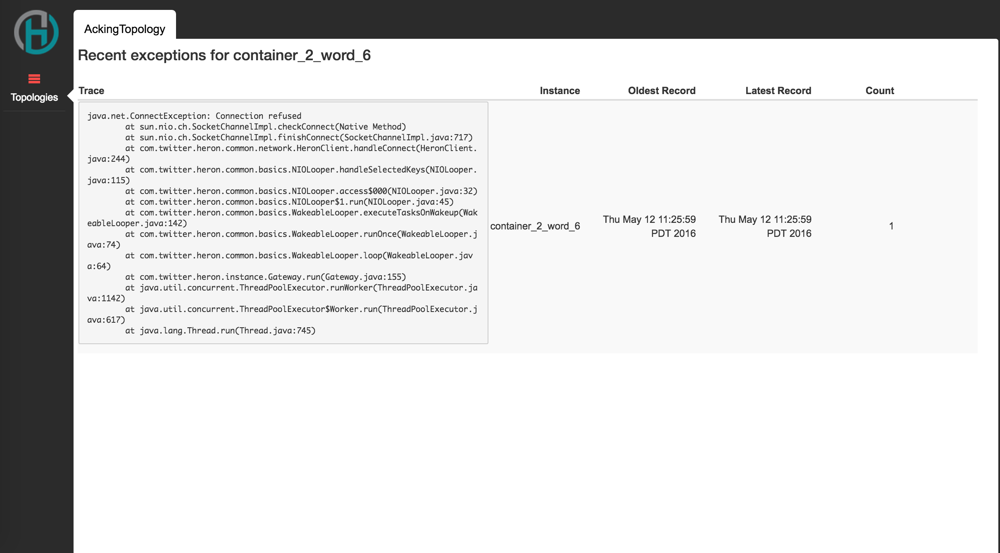

#### PID Page

This link can be used to find the process ID for an instance. Since each instance
runs in its own JVM process, this will be unique for a host. The PID is also
used for other tasks, such as getting jstack or heap dump for an instance.

#### Jstack Page

Click on this link to run the `jstack` command on the host against the PID for
the instance. The output of the command is printed on the page in the browser
itself.

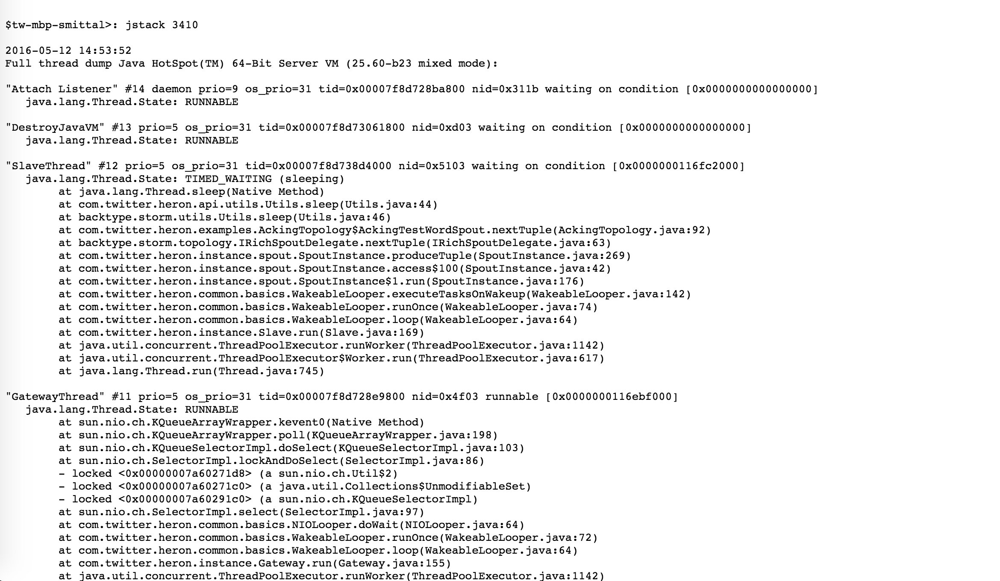

#### Memory Histogram Page

Click on this link to run the `jmap -histo` command on the host against the PID
for the instance. The output of the command is printed on the page in the
browser itself.

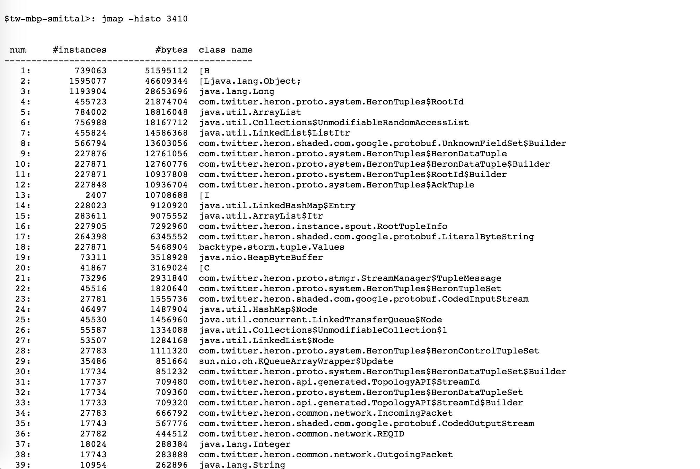

#### Memory Dump page

Click on this link to run the `jmap -dump:format=b,file=/tmp/heap.bin` command
agaist the PID for the instance. Follow the instructions on the page to download
the heap dump file. This link does not download the file.

